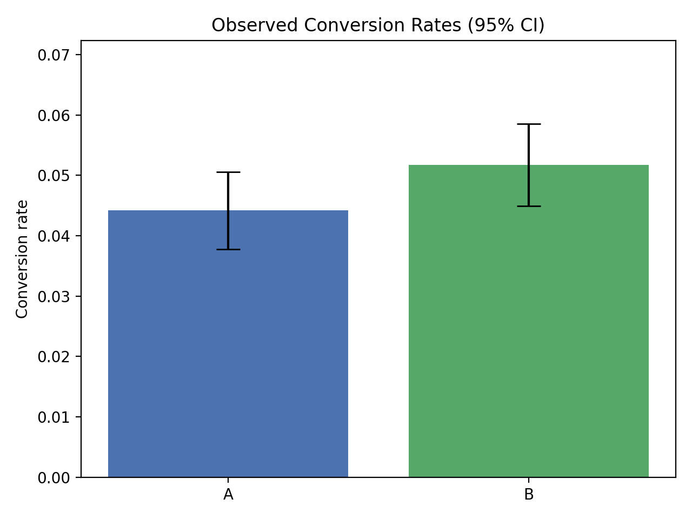
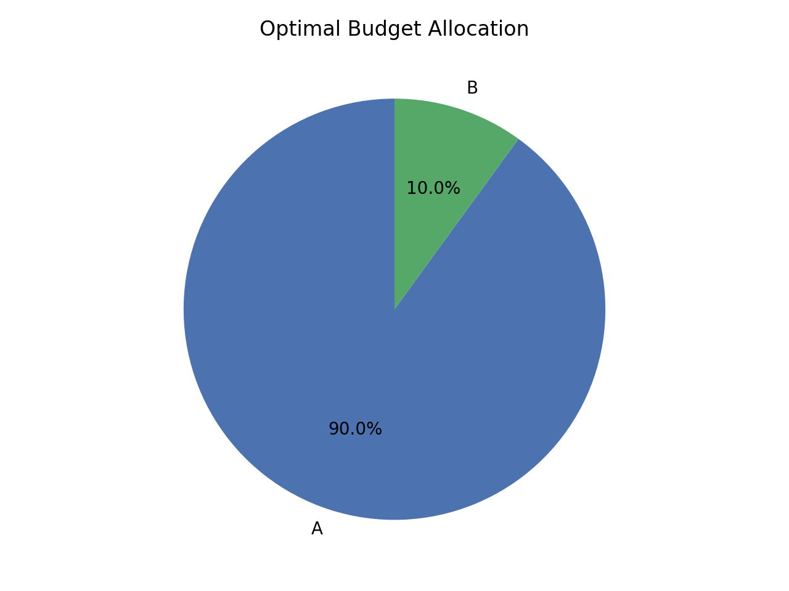

#  Marketing Campaign A/B Testing & Budget Optimisation

This project implements a **complete data pipeline for marketing campaign analysis**, including synthetic data generation, A/B testing, budget optimisation, visualisation, and report generation. It demonstrates statistical testing, linear programming, and data visualisation skills using Python.

---

## 🔹 Features

1. **Data Generation**
   - Generates synthetic user and campaign data (age, income, region, impressions, ad spend, conversions).  
   - Controlled conversion rates for campaigns A and B.  

2. **A/B Testing**
   - Performs **Z-test for proportions** to compare conversion rates between campaigns.  
   - Computes **confidence intervals** for each campaign’s conversion rate.  

3. **Budget Optimisation**
   - Allocates a fixed budget across campaigns to **maximize expected conversions**.  
   - Linear programming used via **PuLP** library.  

4. **Visualisations**
   - Conversion rates with **95% confidence intervals** (bar charts).  
   - Optimal budget allocation (pie charts).  

5. **Report Generation**
   - Auto-generates a **Markdown report** summarising the A/B test, confidence intervals, and budget allocation.  
   - Includes links to generated visualisations.

6. **Interactive CLI**
   - Run individual steps or full pipeline using a simple menu-driven interface.

---

## 🔹 Tech Stack

- Python 3.x
- Pandas, NumPy
- SciPy (for statistical tests)
- Matplotlib (for visualisations)
- PuLP (for optimisation)
- Pathlib & OS (file handling)

---

## 🔹 Project Structure

ab_testing_project/
│
├─ data/ # Synthetic datasets
├─ results/ # Reports and plots
│ └─ plots/
├─ src/
│ ├─ data_generator.py # Generate synthetic data
│ ├─ analysis.py # A/B test & confidence intervals
│ ├─ optimisation.py # Budget optimisation
│ ├─ visualize.py # Plotting functions
│ ├─ report_generator.py# Markdown report generation
│ └─ eda.py # Optional exploratory analysis
├─ main.py # CLI & pipeline execution
└─ README.md


---

##  How to Run

1. **Clone the repo**
```bash
git clone https://github.com/yourusername/ab_testing_project.git
cd ab_testing_project


Install dependencies

pip install -r requirements.txt


Run the project

python main.py


Follow the menu:

1: Generate new data

2: Run A/B test analysis

3: Run budget optimisation

4: Generate visualisations

5: Generate report

6: Run full pipeline

All results, plots, and reports will be saved in the results/ folder.

🔹 Example Outputs

Conversion Rate Plot:


Optimal Budget Allocation:




🔹 Skills Demonstrated

Data analysis & statistical testing

Linear programming & optimisation

Data visualisation & reporting

Modular Python project structure

CLI-based interactive applications

🔹 Future Improvements

Add real-world dataset integration

Add advanced statistical tests (e.g., Bayesian A/B testing)

Add automated PDF report generation

Add unit tests for pipeline modules

Enhance visualisations with Seaborn/Plotly interactive charts

🔹 License

MIT License © [Kashif]


---