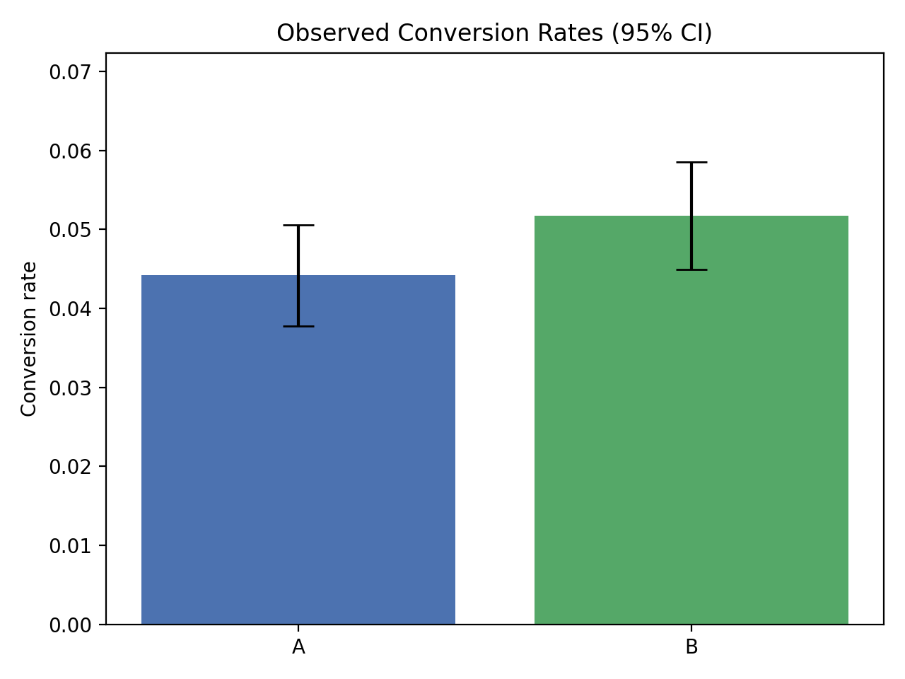

# 📊 A/B Test Report

## 🔎 Campaign Conversion Summary
- Campaign A: 174 / 3938  
  Conversion Rate = **0.044**
- Campaign B: 210 / 4062  
  Conversion Rate = **0.052**

## 📉 Statistical Test (Z-test for proportions)
- Z-score = **-1.572**  
- P-value = **0.1160**

➡️ Result: ⚠️ No significant difference detected.

## 📌 Confidence Intervals (95%)
- Campaign A: 0.038 → 0.051
- Campaign B: 0.045 → 0.059

## 💰 Optimal Budget Allocation
- Campaign A: 900000.0%  
- Campaign B: 100000.0%

📈 Expected Conversions: **17629.8**

---

## 📊 Visualisations
-   
- 

---
_Report auto-generated by the A/B Testing Pipeline._
